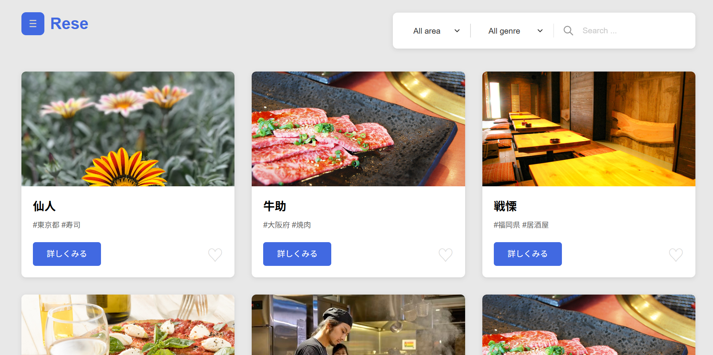

# アプリケーション名
Rese（リーズ）
飲食店予約サービス


## 作成した目的
COACHTECK課題

## 機能一覧
- 【一般ユーザー】
- 会員登録(メール認証)
- ログイン
- ログアウト
- 飲食店一覧取得(エリア、ジャンル、店名検索)
- 飲食店詳細取得
- 飲食店お気に入り追加
- 飲食店お気に入り削除
- 飲食店予約情報追加(事前決済可)
- 飲食店予約情報編集・削除
- 予約店舗レビュー投稿
- ユーザー飲食店お気に入り一覧取得
- ユーザー飲食店予約情報取得
- 【管理者ユーザー】
- 店舗代表者ユーザー管理
- 【店舗代表者ユーザー】
- 店舗管理（追加・編集・削除）
- 予約情報参照（QRコード確認 含）
- お知らせメール送信

## アプリケーションURL
- 開発環境：http://localhost/
- phpMyAdmin：http://localhost:8080/
- mailhog：http://localhost:8025
- Stripe公式サイト：https://stripe.com/jp

## 使用技術(実行環境)
- PHP 8.4
- Laravel Framework 12.39
- MySQL 8.4.7
- mailhog 最新バージョン

## ER図


## 環境構築
1. リポジトリをクローン
``` bash
git clone git@github.com:nga009/Rese.git
```
2. .env.localに値設定
``` text
Stripe公式サイトで自アカウントの「公開可能キー」「シークレットキー」を確認して以下に設定
STRIPE_KEY=（公開可能キー テスト環境用の場合pk_test_で始まる）
STRIPE_SECRET=（シークレットキー  テスト環境用の場合sk_test_で始まる）

※本番環境構築時
.env.productionに本番用の値を設定してください。
Stripe以外の設定値も必要に応じて設定してください。
```
3. DockerDesktopアプリを立ち上げる
4. プロジェクト直下で、以下のコマンドを実行する
``` bash
make init
```
※お使いの環境にmakeコマンドがインストールされていなく上述のコマンドがエラーになる場合は以下のコマンドを実行してください
``` bash
sudo apt install make
```
※本番環境構築時は以下のコマンドを実行
``` bash
make init-production
```


## Stripe決済テスト用のカード番号
``` text
カード番号: 4242 4242 4242 4242
有効期限: 任意の未来の日付（例：12/28）
CVC: 任意の3桁（例：123）
名前: 任意
国または地域: 任意
```

## 登録済テストユーザー
管理者
name: 管理者 
email: admin@example.com  
password: password  

店舗代表者
name: 仙人 
email: sennin@example.com  
password: password  
-------------------------
name: 牛助 
email: gyusuke@example.com  
password: password  
-------------------------
